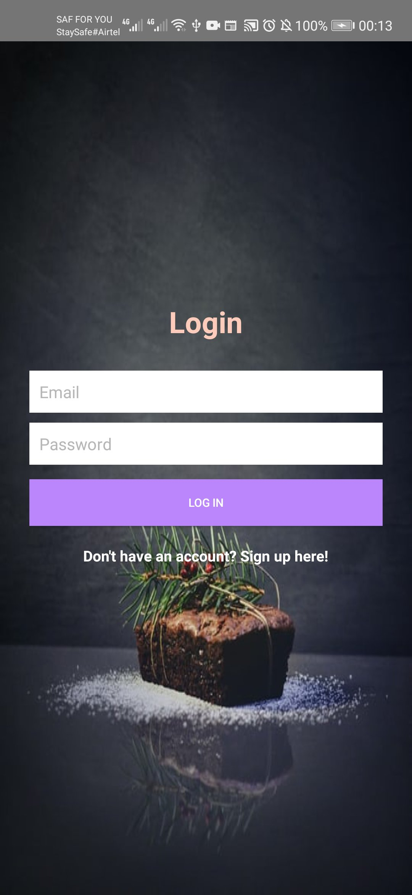

Afri-Recipe
 - Welcome to Afri-Recipe app Where you get instructions of how to cook a delicious meal.

 ## Key Features Done
  - move from one Activity to another
  - accessing static Array.
  - Enjoy the nice MainActivity picture.
  

  

  ## Feauture MVP
  - Linking Activity,Fragment
  

  ## Technologies Used.
  - Android Studio(You can download one here https://developer.android.com/studio)
  - Java Language
  - JUnit 4.12
  - Gradle
  -Firebase
  
  
  ##Demo
  
  
  
  ##ScreenShots
  
  
  

  ## Installation
  - Clone this repository and import into Android studio.
  - git clone here = https://github.com/MUTHAKABRIAN/AllRecipe
  - Enable gradle to import all the dependencies automatically
  - Make sure you have the technologies above
  - Make sure you have Edamam Api for Recipes

  ## Maintainers
  - This project is maintained by Brian Muthaka.
  - [For communication:] (muthakabrian@gmail.com)

  ## Contributing
  - contributing for feature mvp and new ideas are highly welcomed
  - Git clone
  - Set the instructions/technologies required
  - Work and request for git merge .

  ## License and Copyright
  - Copyright (c) 2021 [Brian Muthaka]
    
    Permission is hereby granted, free of charge, to any person obtaining a copy of this software and associated documentation files (the "Software"), to deal in the Software without restriction, including without limitation the rights to use, copy, modify, merge, publish, distribute, sublicense, and/or sell copies of the Software, and to permit persons to whom the Software is furnished to do so, subject to the following conditions:
    
    The above copyright notice and this permission notice shall be included in all copies or substantial portions of the Software.
    
    THE SOFTWARE IS PROVIDED "AS IS", WITHOUT WARRANTY OF ANY KIND, EXPRESS OR IMPLIED, INCLUDING BUT NOT LIMITED TO THE WARRANTIES OF MERCHANTABILITY, FITNESS FOR A PARTICULAR PURPOSE AND NONINFRINGEMENT. IN NO EVENT SHALL THE AUTHORS OR COPYRIGHT HOLDERS BE LIABLE FOR ANY CLAIM, DAMAGES OR OTHER LIABILITY, WHETHER IN AN ACTION OF CONTRACT, TORT OR OTHERWISE, ARISING FROM, OUT OF OR IN CONNECTION WITH THE SOFTWARE OR THE USE OR OTHER DEALINGS IN THE SOFTWARE.